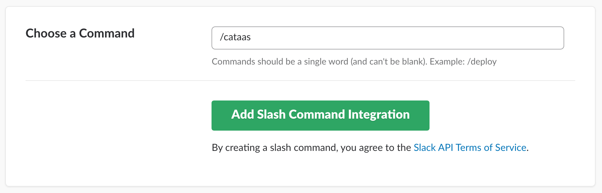
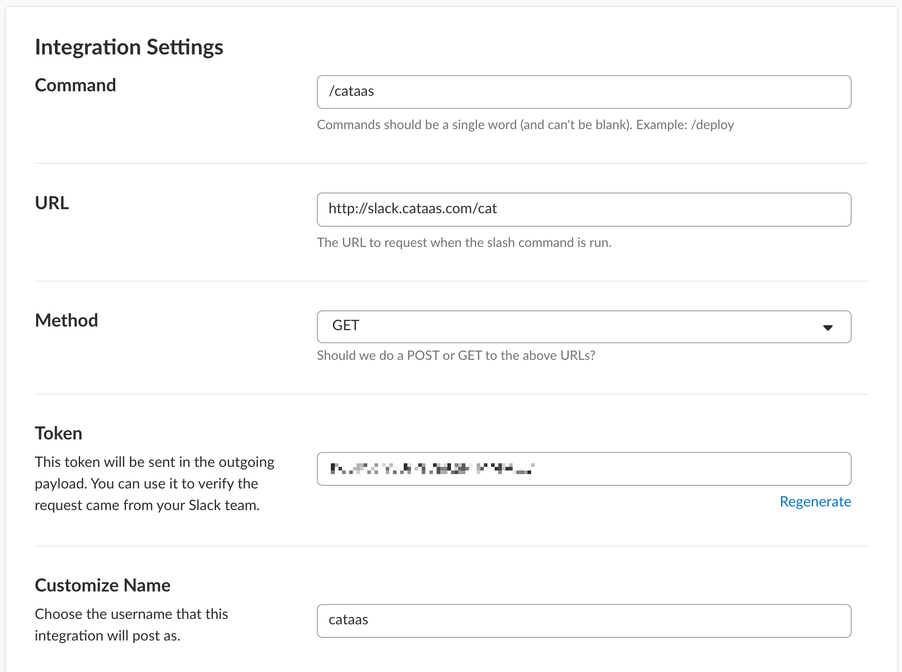
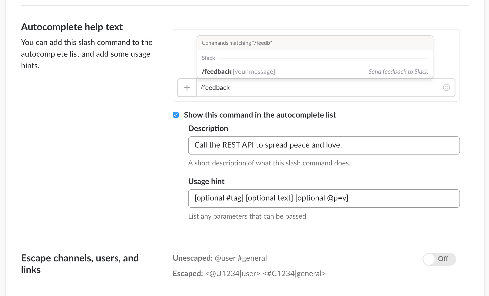
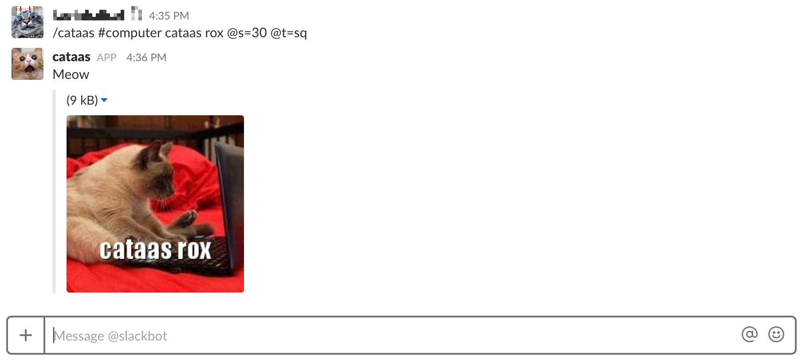

# CATAAS Slack command

Slack command for CATAAS API

More about CATAAS [cataas.com](https://cataas.com)

## Install it

```
node index.js
```

But you can already use in production server `http://slack.cataas.com/cat`

## Integrating into your slack

First you need add custom command into your slack. Sign in to your Slack account and choose your command at [my.slack.com/services/new/slash-commands](my.slack.com/services/new/slash-commands)



Now complet form with values :




Validate and go back to slack.

## Use it

The command is

```
/cataas #tag text @param=value
```

For example :



See [documentation](https://cataas.com) for all paramters
